# 🚀 TaskNotate

<p align="center">
  
</p>

<p align="center"><em>Your ultimate productivity companion — customizable, powerful, and beautifully designed ⏰📝</em></p>

<div align="center">


</div>

---

## ✨ Features Overview

```mermaid
graph TD
    A[TaskNotate Features] --> B[🎯 Task Management]
    A --> C[⏰ Local Notifications]
    A --> D[🎨 Theme Customization]
    A --> E[🖌 Drawing & Notes]
    A --> F[🌍 Multi-language Support]
    A --> G[📅 Calendar & Timeline View]
    C --> H[Full-screen Alarm]
    C --> I[Lock Screen Support]
    C --> J[Reboot-resilient Scheduling]
```



---

## 🌈 Theme Showcase

### Default UI
<p align="center">
  
  
  
  
</p>

### More Screens
<p align="center">
  
  
  
  
  
  
</p>

---

## 🧠 Why TaskNotate?

- 🚀 Clean & modular architecture (Clean + MVC)
- ⏰ Intelligent task scheduling with alarm fallback
- 🎨 Minimal UI designed for focus & clarity
- 🌐 Multilingual UI (🇬🇧 🇸🇦 🇪🇸 🇩🇪 🇨🇳)

---

## 🔔 Alarm System: Behind the Scenes

```mermaid
graph TD
    A[⏰ Alarm Trigger] --> B[Kotlin Alarm Handler]
    B --> C[MethodChannel Bridge]
    C --> D[Flutter Alarm Service]
    D --> E[Alarm State Notifier]
    E --> F[Alarm UI Screen]
```



> Full-screen persistent alarm with dismiss options and lock screen visibility.

---

## 🧱 Tech Stack

| 🔧 Component         | 🚀 Technology                   |
|----------------------|-------------------------------|
| Framework            | Flutter 3.x                   |
| Architecture         | Clean + MVC                   |
| State Management     | GetX                          |
| Local Storage        | SQLite                        |
| Alarm Scheduling     | flutter_local_notifications + alarm |
| Platform Integration | Kotlin                        |
| Drawing Engine       | CustomPaint API               |

---

## 🔁 Sample Code

### Kotlin — Alarm Activity

```kotlin
override fun onCreate(savedInstanceState: Bundle?) {
    if (intent?.action == "com.megoabkm.tasknotate.ALARM_TRIGGER") {
        if (Build.VERSION.SDK_INT >= Build.VERSION_CODES.O_MR1) {
            setShowWhenLocked(true)
            setTurnScreenOn(true)
        } else {
            window.addFlags(
                WindowManager.LayoutParams.FLAG_KEEP_SCREEN_ON or
                WindowManager.LayoutParams.FLAG_TURN_SCREEN_ON or
                WindowManager.LayoutParams.FLAG_SHOW_WHEN_LOCKED
            )
        }
    }
    super.onCreate(savedInstanceState)
}
```

### Dart — Alarm Handler

```dart
void _handleAlarmTrigger(AlarmSettings settings) async {
  await AlarmDisplayStateService.to.setAlarmScreenActive(true);
  Get.offAllNamed(AppRoute.alarmScreen, arguments: {
    'id': settings.id,
    'title': 'Task Reminder',
  });
}

Future<void> stopAlarm(int alarmId) async {
  await Alarm.stop(alarmId);
  await AlarmDisplayStateService.to.setAlarmScreenActive(false);
}
```

---

## 🧪 Try It Now

```bash
git clone https://github.com/MegoABKM/TaskNotate.git
cd TaskNotate
flutter pub get
flutter run
```

---

## 🤝 Contribute

<p align="center">
  <a href="https://github.com/MegoABKM/TaskNotate/pulls">
    
  </a>
  <a href="https://github.com/MegoABKM/TaskNotate/blob/main/LICENSE">
    
  </a>
</p>

> Made with 💙 using Flutter — Help us make it even better!
